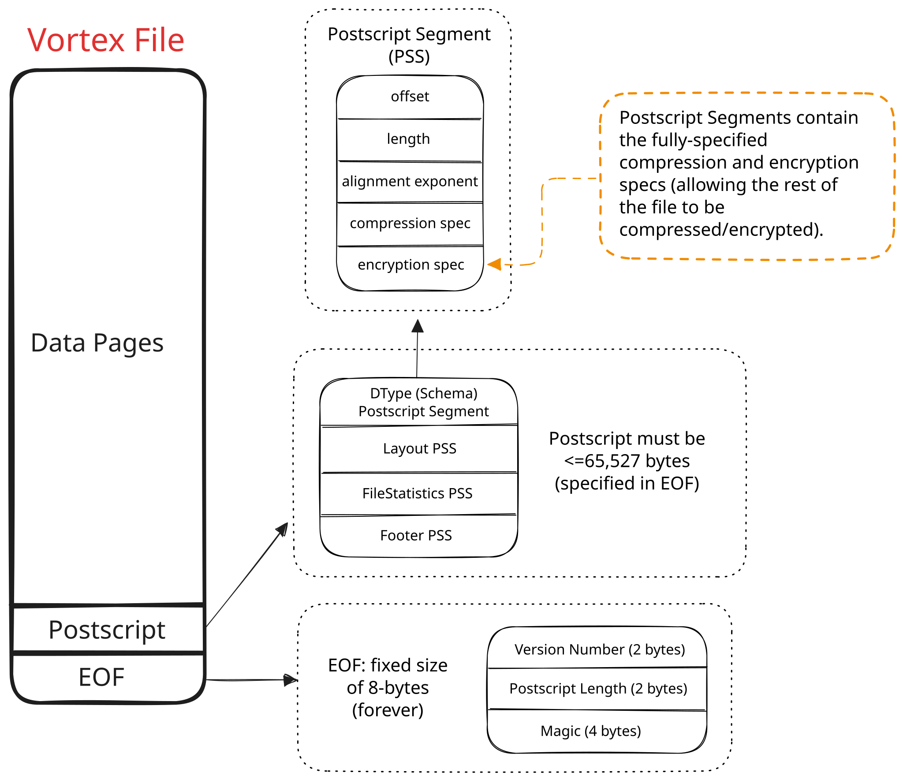

# File Format

:::{important}
The Vortex File Format has been considered stable since the release of version 0.36.0. That means that you can expect all
future versions of the Vortex library to be able to read files written by version 0.36.0 or later (up to and including
the version doing the reading).
:::

:::{seealso}
The majority of the complexity of the Vortex file format is encapsulated in [Vortex Layouts](/concepts/layouts).
Unless you are interested in the specific byte layout of the file, you are probably looking for that documentation!
:::

Recall that [Vortex Layouts](/concepts/layouts) provide a mechanism to efficiently query large serialized Vortex
arrays. The _Vortex File Format_ is designed to provide a container for these serialized arrays, as well as footer
definition that allows efficiently querying the layout.

Other considerations for the Vortex file format include:

* Backwards compatibility, and (coming soon) forwards compatibility.
* Fine-grained encryption.
* Efficient access for both local disk and cloud storage.
* Minimal overhead reading few columns or rows from wide or long arrays.

## File Specification

The Vortex file format has a very small definition, with much of the complexity encapsulated
in [Vortex Layouts](/concepts/layouts).

```
<4 bytes>  magic number 'VTXF'
...        segments of binary data, optionally with inter-segment padding
...        postscript data
<2 bytes>  u16 version tag
<2 bytes>  u16 postscript length
<4 bytes>  magic number 'VTXF'
```

The file format begins and ends with the 4-byte magic number `VTXF`.
Immediately prior to the trailing magic number are two little-endian 16-bit integers: the version tag and the length of the postscript.

:::{important}
**Format version.** The current Vortex file format version is `1`. The version tag records the
format version a file was written against, and a conformant reader MUST reject any file whose
version tag is not *exactly equal* to the version the reader implements. The check is an exact
match, not a `>=` lower bound: a reader that implements version `1` rejects both older and newer
version tags. The reference reader reads the tag from the end-of-file marker and bails with an
"unsupported version" error on any mismatch.
:::

The exact-match rule coexists with the [Backward Compatibility](#backward-compatibility) guarantee
below because the **format version tag is deliberately stable**: additive FlatBuffer evolution (new
optional fields, new union variants appended at the end) does **not** bump it, so every library
release since 0.36.0 both writes and reads format version `1`. The tag changes only on a breaking
wire change a reader genuinely cannot interpret; until then "a newer library reads an older file"
holds *precisely because* both files are format version `1`. (A library version such as `0.36.0` is
distinct from the format version tag `1`.)

:::{note}
**Leading versus trailing magic.** Both the leading and trailing 4-byte markers are `VTXF`. The
reference reader validates only the *trailing* magic — the copy inside the 8-byte end-of-file
marker, which it reads first — and does not currently read or validate the leading marker. The
leading marker is written to identify the file at its start for external tooling; a reader that
chooses to validate it MUST likewise require it to equal `VTXF`.
:::

A minimal Vortex file thus consists of just these byte ranges, plus the alignment, encryption, and compression
configurations for the other pieces of metadata.



## Postscript

The postscript contains the locations of:

1. a `dtype` segment representing the top-level logical data type (i.e., schema) — *optional*; when absent, the reader must obtain the root `DType` from an external source before binding the layout
2. a `layout` segment containing the root `Layout` — *required*
3. a `statistics` segment containing file-level per-field statistics (e.g., minima and maxima of each field/column, for whole-file pruning) — *optional*
4. a `footer` segment containing a dictionary-encoded _segment map_, and other shared configuration such as compression and encryption schemes — *required*

:::{literalinclude} ../../vortex-flatbuffers/flatbuffers/vortex-file/footer.fbs
:start-after: [postscript]
:end-before: [postscript]
:::

## Data Type

Both viewed arrays and viewed layouts require an external `DType` to instantiate them. This helps us to avoid
redundancy in the serialized format since it is very common for a child array or layout to inherit or infer its data
type from the parent type.

The root `DType` segment is a flat buffer serialized `DType` object. See [DType Format](/specification/dtype-format) for more
information.

:::{note}
Unlike many columnar formats, the `DType` of a Vortex file is not required to be a `StructDType`. It is perfectly
valid to store a `Float64` array, a `Boolean` array, or any other root data type.
:::

## Footer

The footer is a flat buffer serialized `Footer` object. This object contains all the information required to
load the root `Layout` object into a usable `LayoutReader`.
For example, it contains the locations, compression schemes, encryption schemes, and required alignment of all segments in the file.

:::{literalinclude} ../../vortex-flatbuffers/flatbuffers/vortex-file/footer.fbs
:start-after: [footer]
:end-before: [footer]
:::

:::{note}
**Alignment is base-2-exponent encoded.** The `alignment_exponent` field carried by each
`SegmentSpec` (in the footer's segment map) and each `PostscriptSegment` (in the postscript) stores
the *log2* of the segment's required byte alignment, not the alignment itself. A reader recovers the
required alignment as `1 << alignment_exponent` — for example, an `alignment_exponent` of `10`
denotes 1024-byte alignment.
:::

The footer is separated from the Data Type such that large schemas can be omitted from the file if they can be
shared or fetched from an external source.

## Reified File Example

Since Vortex files are largely self-describing, many mainstays of other columnar file formats (e.g., whether or not to
have row groups) are decided by the **writer**, rather than being a rigid part of the specification. To build intuition,
consider an example Vortex file with two non-nullable columns, "A" of type i32, and "B" of type UTF-8. Using the defaults
as of June 2025, it might look as follows.


## Write Completeness and File Integrity

The Vortex file format is aggressively self-describing: the footer's segment map, the root
`DType`, and the [Layout](/concepts/layouts) tree together *declare* what the file contains, and
a reader takes those declarations at face value. That design keeps reads cheap — a reader never has
to scan the body to discover its shape — but it moves a burden onto the **writer**: the declarations
in the footer are a promise, and every byte they promise must actually be in the file. A file whose
footer is syntactically well-formed but whose declarations out-run the bytes that were written is
*silently corrupt* — it opens cleanly and reads back fewer rows (or empty columns) than were
intended, with no error raised.

This failure mode is real: a background write task that panics and closes its output channel without
propagating the failure can leave behind a structurally-valid file that is empty or missing chunks
rather than raising a loud write error.
The section below states the invariant a conformant writer must uphold, and the validation a
conformant reader must perform so that such a file is rejected loudly instead of read as if it were
complete.

### The write-completeness invariant

A conformant writer MUST NOT finalize a file — write the trailing postscript, version tag, and
closing magic number — unless all of the following hold. A file that satisfies them is *complete*;
a file that does not is corrupt even if it parses.

1. **Every declared segment is backed by real bytes.** For each `SegmentSpec` in the footer's
   segment map, the byte range `[offset, offset + length)` must lie within the file and contain the
   segment's complete payload. The writer records a segment's location *and* emits its bytes; if the
   bytes are ever dropped (for example because a background task failed after the location was
   recorded), the map entry becomes a promise the file cannot keep, and the write must fail rather
   than complete.
2. **Segment offsets are non-decreasing.** Segments are laid out in ascending offset order (readers
   reject an out-of-order map).
3. **Every referenced segment exists.** Each `SegmentId` named by any node of the root layout tree
   must resolve to an entry in the segment map.
4. **Row counts are consistent throughout the layout tree.** The `row_count` a layout node declares
   must agree with the data beneath it:
   - a **chunked** layout's `row_count` equals the sum of its children's `row_count`s;
   - a **struct / columnar** layout carries exactly one child per field of its `DType` (plus one
     leading validity child when the struct is nullable), and — because a struct is a row-aligned
     bundle of columns — **every field column spans the same number of rows** as the struct itself.
     Equal row counts across all columns is the rule that makes a projection of any subset of columns
     reconstruct the same rows;
   - a **flat** (leaf) layout's `row_count` equals the number of elements in the array serialized
     into its segment.
5. **All required segments are present.** The `layout` and `footer` segments are mandatory; the
   `dtype` segment is mandatory unless the writer deliberately excludes it (see
   [Data Type](#data-type)); and if the footer declares a `statistics` segment, that segment must be
   present and complete.

:::{important}
File-level statistics are *advisory*, not an integrity backstop. They are optional, per-field, and
derived by the writer from the same data stream, so they cannot be used to independently confirm that
the body is complete.
:::

### Reader-side validation

Because the writer's promise can be violated (by the bug above, by a truncated upload, or by any
partial write), a conformant reader MUST verify the file against its own declarations and raise an
error on any mismatch, rather than silently serving whatever parsed. At minimum a reader MUST:

1. **Require the mandatory segments.** Reject a file whose postscript is missing the `layout` or
   `footer` segment, whose footer carries no segment map, or that declares a `statistics` segment
   which cannot be resolved.
2. **Reject an out-of-order segment map** (offsets not non-decreasing).
3. **Resolve every referenced segment.** Every `SegmentId` reachable from the root layout must index
   a real entry in the segment map; a dangling reference is an error, not an empty read.
4. **Enforce exact segment lengths on fetch.** A segment read must return exactly `length` bytes; a
   short read — the signature of a range that runs past the true end of the file — is an error.
5. **Cross-check row counts** as it binds and decodes the layout tree: chunk sums against the parent
   chunked `row_count`; the child count of a struct/columnar layout against its `DType`; the equal
   per-column row counts of a struct; and each leaf array's decoded length against the `row_count`
   its flat layout declared.

:::{warning}
**The layout tree is the file's only record of row counts.** There is no independent, file-level
"expected total row count" stored outside the tree, so the checks above can only prove a file is
*internally consistent* — not that it is *complete*. A file whose layout tree was truncated before it
was finalized (fewer chunks, or a smaller root `row_count`, than the producer intended) is perfectly
self-consistent and reads back as a smaller-but-valid file; a reader cannot detect the missing
trailing rows from the file alone. This is precisely why completeness is fundamentally a *writer*
obligation: the reader's validation catches contradictions, but only the writer can guarantee the
declarations describe everything that should have been written.
:::

:::{note}
A fully conformant reader **MUST** perform all of the checks above uniformly. In particular it MUST
validate a struct/columnar layout's child *count* against the schema **and** verify that every column
declares the same `row_count` (otherwise an unequal-length struct binds without complaint and diverges
only when a row range spanning the short column is scanned); it MUST enforce the chunked row-count sum
and each leaf's decoded-length and `DType`; and it MUST perform these cross-checks **eagerly** at open
time, surfacing them as **recoverable errors** rather than deferring them to first access or to
process-aborting assertions.
:::

## Backward Compatibility

Backward compatibility guarantees that any **older** Vortex file can be read by **newer** versions of the Vortex library,
and is expected from all releases of Vortex from version 0.36.0 onwards.

## Forward Compatibility

:::{warning}
Forward compatibility is not yet implemented, but is planned to ship prior to the 1.0 release.
:::

Forward compatibility extends the preceding stability guarantee such that **newer** Vortex files can be read by
**older** versions of the Vortex library.

The intent of this work is to allow us to continue to evolve the Vortex File Format, avoiding calcification
and remaining up-to-date with new compression codecs and layout optimizations -- without breaking existing
readers or requiring lockstep upgrades.

The plan is that at write-time, a minimum supported reader version is declared. Any encodings or layouts added after that minimum
reader version can then be embedded into the file with WebAssembly decompression logic. Old readers are able to decompress new
data (slower than native code, but still with SIMD acceleration) and read the file. New readers are able to make the best use of
these encodings with native decompression logic and additional push-down compute functions (which also provides an incentive to upgrade).
